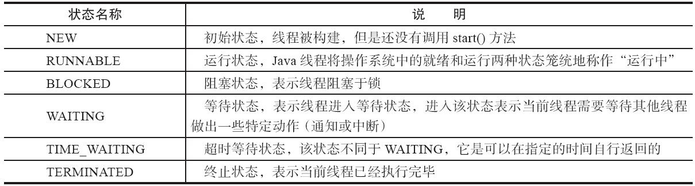
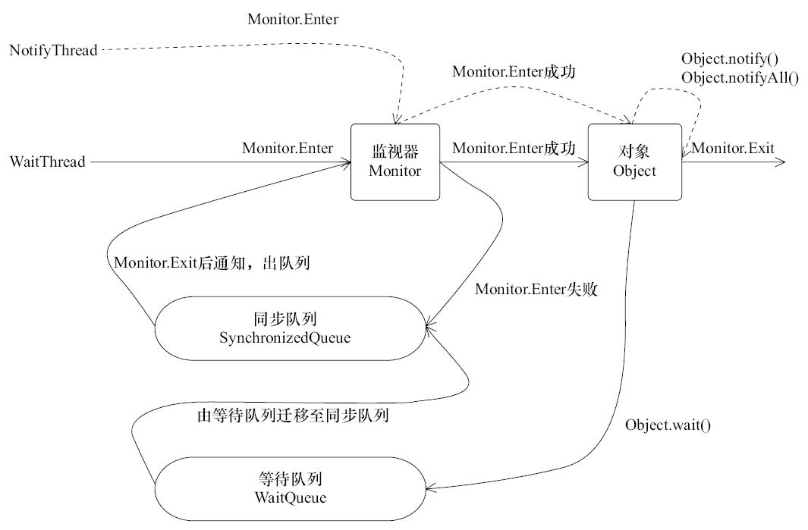
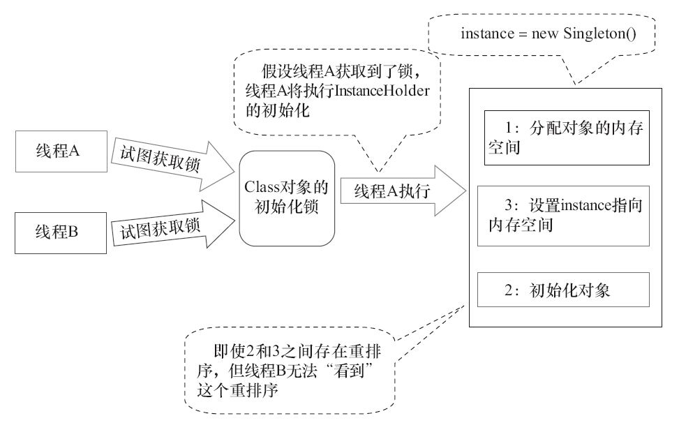
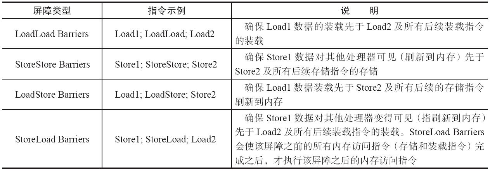

# 多线程 #

## 线程和进程 ##

线程和进程的区别：

1. 进程是资源分配的最小单位；线程是程序调度的最小单位。
2. 一个进程包含多个线程，一个线程只能在一个进程之中。每一个进程最少包含一个线程。
3. 每启动一个进程，系统都会为其分配地址空间；线程没有独立的地址空间，同一进程的线程共享本进程的地址空间。
4. 进程切换开销大；线程执行开销小。

**使用多线程的原因**

1. 更多的处理器核心数量，更加适合多线程处理。使用单线程是对资源的浪费。

2. 数据一致性不强的操作，可以使用多线程来处理，缩响应时间。

## 线程的创建 ##

1. 新建一个类，继承Thread类，重写其中的run方法。然后实例化这个类，直接使用这个类的start方法，即可启动这个线程。
2. 实现runnable接口，实现其中的run方法，将这个runnable接口的实现作为Thread类的构造方法的参数，对Thread类进行实例化，调用Thread对象的start方法。
3. 实现callable接口，将实现的callable接口的实现作为FeatureTask类的构造方法，构造一个FeatureTask类的实现，然后将这个实现作为Thread类的构造方法的，然后启动这个线程。

```java
// 1. 通过 FutureTask 实现 RunnableFuture 接口，RunnableFuture 接口继承自 Runnable 和 Future 两个接口。
// 2. Callable 接口是 FutureTask 的一个成员变量。
// 3. 在 FutureTask 内部维护一套任务进度的状态，通过 CAS 乐观锁来对状态的修改。
// 4. 将任务的返回的结果作为 FutureTask 对象的一个成员变量，通过自定义实现 RunnableFuture <- Runnable 的 run 
// 方法，在 run 方法中执行 Callable.call 然后设置任务进度的状态。
// 5. FutureTask 的 get 方法：在任务没有执行完成的时候，就调用 LockSupport.park(t) ，并将其添加一个阻塞队列中。如果已经完成了，那么就从 3 的 
// FutureTask 的成员变量中取得任务的返回值。
// 6. 在任务执行完成的时候，如果等待队列中存在等待的 WaitNode ，就调用 LockSupport.unpark(t) 方法，
// 将其从挂起状态恢复。然后获取到 4 中的任务执行的结果。
```


## 线程的状态 ##




1. 初始化
2. 就绪：该状态的线程位于可运行线程池中，等待被线程调度选中，获取cpu的使用权。
3. 运行中：可运行状态(runnable)的线程获得了cpu 时间片，执行程序代码。
4. 等待
5. 计时等待
6. 阻塞
7. 终止

在Java线程中，其中**就绪**和**运行中**统一被称为可运行状态。

### 就绪 ###

start 方法被调用，线程立即进入了就绪状态，表示这个线程具有了运行的条件，但是还没有开始运行，这就是就绪状态。线程就绪，但不意味着立即调度执行，因为要等待CPU的调度，一般来说是**进入了就绪队列**。但是还有另外三种情况，线程也会进入就绪状态，四种分别是：

1. start()方法调用。
2. 本来处于阻塞状态，后来阻塞解除。
3. 如果运行的时候调用 yield() 方法，避免一个线程占用资源过多，中断一下，会让线程重新进入就绪状态。注意，如果调用 yield() 方法之后，没有其他等待执行的线程，此线程就会马上恢复执行。
4. JVM 本身将本地线程切换到了其他线程，那么这个线程就进入就绪状态。

**yield() 是Thread的静态方法。调用Thread.yield()的线程在cpu时间片上让步。**

### 阻塞 ###

阻塞状态指的是代码不继续执行，而在等待，阻塞解除后，重新进入就绪状态。

也就是说，阻塞状态发生肯能是运行状态转过去的， 运行状态 - > 阻塞状态，不会从就绪状态转过去。

阻塞的方法有四种：

1. sleep()方法，是占用资源在睡觉的，可以限制等待多久；
2. wait() 方法，和 sleep() 的不同之处在于，是不占用资源的，限制等待多久；
3. join() 方法，加入、合并或者是插队，这个方法阻塞线程到另一个线程完成以后再继续执行；
4. 有些 IO 阻塞，比如 write() 或者 read() ，因为IO方法是通过操作系统调用的。

join() 是对象方法，在a线程的代码中调用b.join()，表示a线程要在b线程之后执行，也就是b线程插队（join）a线程。

### 中断 ###

关于中断的三个方法

1. interrupt()
    - Thread 类的实例方法：将某个线程标记成中断中断状态。
2. interrupted()
    - Thread 类的静态方法：重置调用该方法的线程的中断状态。
3. isInterrupted()
    - Thread 类的实例方法：判断线程有没有中断状态。

“许多声明抛出InterruptedException的方法（例如Thread.sleep(long millis)方法）这些方法在抛出InterruptedException之前，Java虚拟机会先将该线程的中断标识位清除，然后抛出InterruptedException，此时调用isInterrupted()方法将会返回false。”

## 线程间通信 ##

如果每个线程都单独的运行，线程和线程之间没有相互配合和沟通，这样的多线程是价值是很低的。

## 等待通知 ##

等待 / 通知方法是所有的Java对象都具备的，在 Object 类中定义的基本方法可以实现这个功能的：


例子：

### 三个线程轮番打印 ###

```java
package com.xuzhongjian.thread;

public class ThreeThread {
    public static void main(String[] args) {
        Object a = new Object();
        Object b = new Object();
        Object c = new Object();

        new DemoThread(a, b, "a").start();
        new DemoThread(b, c, "b").start();
        new DemoThread(c, a, "c").start();
    }

    static class DemoThread extends Thread {
        private final Object cur;
        private final Object next;
        DemoThread(Object cur, Object next, String name) {
            this.cur = cur;
            this.next = next;
            this.setName(name);
        }

        @Override
        public void run() {
            while (true) {
                try {
                    synchronized (next) {
                        synchronized (cur) {
                            System.out.println(Thread.currentThread().getName());
                            cur.notify();
                        }
                        Thread.sleep(10);
                        next.wait();
                    }
                } catch (Exception e) {
                    e.printStackTrace();
                }
            }
        }
    }
}
```

## note ##



1. 使用wait、notify、notifyAll方法需要在这个对象的synchronized中，就是要先持有这个对象的监视器。

2. 调用wait方法之后，线程的状态由 RUNNING 变为 WAITING，会释放锁，但是wait方法会被阻塞。

3. wait调用后，等待这个对象的notify方法被调用，并且调用notify的方法从synchronized代码块退出之后，wait方法才会执行结束再返回。

4. notify()方法将等待队列中的一个等待线程从等待队列中移到同步队列中，而notifyAll()方法则是将等待队列中所有的线程全部移到同步队列，被移动的线程状态由WAITING变为BLOCKED。

## 经典范式 ##

**等待方**

```java
    synchronized(o){
        // 条件不满足
        while(!condition){
            // 被通知之后还是需要检查状态
            o.wait();
        }
        // TODO something
    }
```

**通知方**

```java
    synchronized(o){
        // 改变 condition
        o.notify();
    }
```

# synchronized与同步 #

1. 静态方法

   所有的这个类的实例化的对象中，只能有一个线程能执行这个方法。

2. 实例方法

   同一个实例，只能有一个线程执行这个方法。

3. this：

   “锁”this，表示持有这个对象的锁。this 能够保证同步的前提是，同一个对象，特殊的，这个对象就是这个方法执行的本体。也就是说，this同步的场景是，同一个对象在多个线程里面执行同一个方法，这个时候可以使用synchronized(this)来同步。

4. object

   和 this 类似的，object只能同时被一个线程持有，不能同时被多个线程持有。持有这个额对象的类才能执行方法。

## 原理 ##

Java的每一个对象都有一个监视器（monitor），通过对Java的「.class」文件信息分析可以看到，使用synchronized对代码进行同步就是执行 monitorenter 和monitorexit 指令。所以 synchronized 锁定的其实只是对象的监视器。只有获取到指定的对象的监视器的线程才能执行。

**关于monitor：**

monitor对象存在于每个Java对象的对象头中，synchronized锁便是通过这种方式获取锁的，也是为什么Java中任意对象可以作为锁的原因。

## 双重校验的单例模式 ##

### 懒汉 - 线程不安全单例模式 ###

```java
package com.xuzhongjian.model;

import java.util.Objects;

/**
 * 懒汉 - 线程不安全 单例模式
 *
 * @author zjxu97 at 12/31/20 2:53 PM
 */
public class Instance {

    private static Instance instance;

    private Instance() {

    }

    public static Instance getInstance() {
        if (Objects.isNull(instance)) {
            instance = new Instance();
        }
        return instance;
    }
}
```

### 懒汉 - 线程安全单例模式 ###

上面是一个懒汉式线程不安全的单例模式，其中的静态方法 getInstance 可能会被多个方法同时调用。然后多个线程对 instance 这个静态变量的处理可能是一致的，也就是都认为其是一个空对象，没有被初始化。使用下面的方法，可以将其编程线程安全的单例模式：

```java
package com.xuzhongjian.model;

import java.util.Objects;

/**
 * 懒汉 - 线程安全 单例模式
 *
 * @author zjxu97 at 12/31/20 2:53 PM
 */
public class Instance {

    private static Instance instance;

    private Instance() {

    }

    public synchronized static Instance getInstance() {
        if (Objects.isNull(instance)) {
            instance = new Instance();
        }
        return instance;
    }
}
```

改动的地方只有一处，那就是在静态方法上加上了一个 synchronized 。加上这个变量的作用是，该方法只能同时允许一个地方调用，不允许多个位置调用。

但是在早期的JVM中，synchronized存在巨大的性能问题，所以提出了双重校验的办法：

### 双重校验 单例模式 ###

```java
package com.xuzhongjian.model;

import java.util.Objects;

/**
 * 双重校验 单例模式
 * 存在初始化风险
 *
 * @author zjxu97 at 12/31/20 2:53 PM
 */
public class Instance {

    private static Instance instance;

    private Instance() {

    }

    public static Instance getInstance() {
        if (Objects.isNull(instance)) {
            synchronized (Instance.class) {
                if (Objects.isNull(instance)) {
                    instance = new Instance();
                }
            }
        }
        return instance;
    }
}

```

这样的双重校验的方法可能存在的问题是，当上一个线程还没有将实例完全初始化，然后后一个线程读取到的对象还没有完全初始化。

如果使用 volatile，将instance实例变成 volatile 字段，可以解决这个问题：

```java
/**
 * 双重校验 单例模式
 * 终极版双重校验
 *
 * @author zjxu97 at 12/31/20 2:53 PM
 */
public class Instance {

    private volatile static Instance instance;

    private Instance() {

    }

    public static Instance getInstance() {
        if (Objects.isNull(instance)) {
            synchronized (Instance.class) {
                if (Objects.isNull(instance)) {
                    instance = new Instance();
                }
            }
        }
        return instance;
    }
}

```

这样就可以实现线程安全的返回延迟的实例化。

### 静态内部类 ###

使用静态内部类的方式实现单例模式：

```java
package com.xuzhongjian.model;

/**
 * 静态内部类实现单例模式
 *
 * @author zjxu97 at 12/31/20 2:53 PM
 */
public class Instance {

    private static class InnerInstance {
        private static Instance instance = new Instance();
    }

    private Instance() {

    }

    public static Instance getInstance() {
        return InnerInstance.instance;
    }
}
```

利用了类加载的时候 JVM 的Class初始化锁：




A线程首先拿到锁之后，对 instance 的 Class 对象进行初始化，待初始化完成之后，释放锁。再由 B 获取到锁之后，就不存在并发问题了，就能直接取到InnerInstance 的其中的静态变量。

# volatile #

## 先行发生原则 ##

happens-before

1. 单线程原则

   单线程中的操作，一个操作happens-before其之后的操作。

2. 加锁解锁原则

   一个锁的加锁操作happens-before一个锁的解锁及以后的操作。

3. volatile原则

   volatile的字段的写操作，happens-before这个字段的读操作。

4. 传递性

   happens-before具有传递性。

5. 线程启动

   A线程启动B线程，A的启动操作happens-before B线程中的所有操作。

6. 线程终止

   线程内部的所有操作优先于线程终止操

7. join

   A线程调用B线程的join方法，B线程中剩余的操作happens-before A线程的join方法的返回。

8. 对象终结规则

   一个对象的初始化完成先行于发生它的finalize（）方法的开始。

## Java内存模型抽象 ##

1. 整个Java进程有一个主内存，这个内存区域中存放所有的共享变量。

2. 除了主内存之外，每一个线程都会对应一个本地内存的区域。

3. 当线程需要取用变量的时候，从主内存中取得变量的副本，放置在本地内存中。

关键字volatile可以用来修饰字段（成员变量），就是告知程序任何对该变量的访问均需要从共享内存中获取，而对它的改变必须同步刷新回共享内存，它能保证所有线程对变量访问的可见性。

volatile 的两个作用：

1. 保证内存可见性
   - 保证变量的修改，每次的写入都是直接写入到主内存中；每次对变量的读取都是从主内存中读取；
2. 防止指令重排
   - 在volatile操作前后添加上内存屏障，禁止指令重排。

## volatile的内存屏障 ##

为了在JMM体系中从底层保持内存可见性，Java代码在编译成底层指令的时候会添加内存屏障。



1. 在每个volatile写操作的前面插入一个StoreStore屏障。
2. 在每个volatile写操作的后面插入一个StoreLoad屏障。
3. 在每个volatile读操作的后面插入一个LoadLoad屏障。
4. 在每个volatile读操作的后面插入一个LoadStore屏障。


# 线程池源码分析 #

线程池的核心代码在 ThreadPoolExecutor 类。


## 几个参数 ##

```java
    public ThreadPoolExecutor(int corePoolSize,
                              int maximumPoolSize,
                              long keepAliveTime,
                              TimeUnit unit,
                              BlockingQueue<Runnable> workQueue,
                              ThreadFactory threadFactory,
                              RejectedExecutionHandler handler) {
        if (corePoolSize < 0 ||
            maximumPoolSize <= 0 ||
            maximumPoolSize < corePoolSize ||
            keepAliveTime < 0)
            throw new IllegalArgumentException();
        if (workQueue == null || threadFactory == null || handler == null)
            throw new NullPointerException();
        this.acc = System.getSecurityManager() == null ?
                null :
                AccessController.getContext();
        this.corePoolSize = corePoolSize;
        this.maximumPoolSize = maximumPoolSize;
        this.workQueue = workQueue;
        this.keepAliveTime = unit.toNanos(keepAliveTime);
        this.threadFactory = threadFactory;
        this.handler = handler;
    }
```

1. corePoolSize：线程池的基本大小，用于执行的运行中的线程的池子。
2. maximumPoolSize：最大线程数量，线程池允许创建的最大线程数。
       如果队列满了，并且已创建的线程数小于最大线程数，则线程池会再创建新的线程执行任务。值得注意的是，如果使用了无界的任务队列这个参数就没什么效果。
3. keepAliveTime & unit：线程池的工作线程空闲后，保持存活的时间。
       如果任务很多，并且每个任务执行的时间比较短，可以调大时间，提高线程的利用率。
4. workQueue：等待队列，在核心池线程运行中的线程达到指定的数量的时候，将后面提交的任务存储到这个队列中。
5. threadFactory：线程工厂，用来设置创建线程的策略。
       使用开源框架guava提供的ThreadFactoryBuilder可以快速给线程池里的线程设置有意义的名字。
6. handler：拒绝策略。
       AbortPolicy：直接抛出异常。
       CallerRunsPolicy：只用调用者所在线程来运行任务。
       DiscardOldestPolicy：丢弃队列里最近的一个任务，并执行当前任务。
       DiscardPolicy：不处理，丢弃掉。

### 阻塞队列 ###

| 线程池                            | 队列                |
| --------------------------------- | ------------------- |
| Executors.newFixedThreadPool      | LinkedBlockingQueue |
| Executors.newCachedThreadPool     | SynchronousQueue    |
| Executors.newScheduledThreadPool  | DelayedWorkQueue    |
| Executors.newSingleThreadExecutor | LinkedBlockingQueue |

**LinkedBlockingQueue**

队列大小无限制，常用的LinkedBlockingQueue，使用该队列做为阻塞队列时要尤其当心，当任务耗时较长时可能会导致大量新任务在队列中堆积最终导致OOM。当QPS很高，发送数据很大，大量的任务被添加到这个无界中，导致cpu和内存飙升服务器挂掉。

**SynchronousQueue**

如果不希望任务在队列中等待而是希望将任务直接移交给工作线程，可使用SynchronousQueue作为等待队列。SynchronousQueue不是一个真正的队列，而是一种线程之间移交的机制。要将一个元素放入SynchronousQueue中，必须有另一个线程正在等待接收这个元素。只有在使用无界线程池或者有饱和策略时才建议使用该队列。

SynchronousQueue没有容量，是无缓冲等待队列，是一个不存储元素的阻塞队列，会直接将任务交给消费者，必须等队列中的添加元素被消费后才能继续添加新的元素。使用SynchronousQueue阻塞队列一般要求maximumPoolSizes为无界(Integer.MAX_VALUE)，避免线程拒绝执行操作。

**有界队列**

常用的有两类，一类是遵循FIFO原则的队列如ArrayBlockingQueue，另一类是优先级队列如PriorityBlockingQueue。PriorityBlockingQueue中的优先级由任务的Comparator决定。 
使用有界队列时队列大小需和线程池大小互相配合，线程池较小有界队列较大时可减少内存消耗，降低cpu使用率和上下文切换，但是可能会限制系统吞吐量。

## 提交一个任务 ##

java.util.concurrent.AbstractExecutorService#submit(java.lang.Runnable)

```java
    public Future<?> submit(Runnable task) {
        if (task == null) throw new NullPointerException();
        RunnableFuture<Void> ftask = newTaskFor(task, null);
        execute(ftask);
        return ftask;
    }
```

java.util.concurrent.AbstractExecutorService#newTaskFor(java.lang.Runnable, T)

```java
    protected <T> RunnableFuture<T> newTaskFor(Runnable runnable, T value) {
        return new FutureTask<T>(runnable, value);
    }
```

java.util.concurrent.ThreadPoolExecutor#execute

```java
    /**
     * 在未来的某个时刻执行给定的任务。
     * 这个任务可能在一个新线程也有可能在一个已经存在的线程里被执行。
     * 
     * 如果这个线程无法被提交、执行。或者是这个线程池已经被关闭，或者容量已经到了。
     * 那么这个任务就会按照当前的拒绝策略来处理。
     *
     * @param command 被执行任务。
     * @throws RejectedExecutionException 拒绝执行异常
     * @throws NullPointerException 如果给出的任务为空
     */
    public void execute(Runnable command) {
        if (command == null)
            throw new NullPointerException();
        /*
         * Proceed in 3 steps:
         *
         * 1. 如果核心池的容量还没到（运行中的线程数量），尝试去开启一个新的线程。
         * 将这个任务作为这个新线程的第一个任务。
         *
         * 2. 如果这个任务能被成功的加入队列中，我们仍然需要双重校验一下，我们是否需要
         * 添加一个新的线程，如果之前的线程死了在上次检查之后，或者这个线程池关闭了。
         * 所以我们二次校验一下。我们新建一个线程或者回退这次的进入队列。
         *
         * 3. 如果无法加入到队列中，尝试去创建一个新的线程，如果失败了，就拒绝这个任务。
         */
        int c = ctl.get();
        if (workerCountOf(c) < corePoolSize) {
            if (addWorker(command, true))
                return;
            c = ctl.get();
        }
        // 运行的线程数量已经饱和了 && 成功的向阻塞队列中添加了这个任务
        if (isRunning(c) && workQueue.offer(command)) {
            int recheck = ctl.get();
            // 线程池状态不是RUNNING状态，说明执行过shutdown命令，需要对新加入的任务执行reject()操作
            // 这里需要recheck，是因为任务入队列前后，线程池的状态可能会发生变化
            if (! isRunning(recheck) && remove(command))
                reject(command);
            else if (workerCountOf(recheck) == 0)
                addWorker(null, false);
        }
        else if (!addWorker(command, false))
            reject(command);
    }
```

java.util.concurrent.ThreadPoolExecutor#addWorkers

```java
    /**
     * 根据当前的线程池的状态、核心或最大容量来判断一个新的工作线程能否被添加到
     * 当前的线程池。如果可以的话，相应的调整线程数量的计数值，如果可能，将创建
     * 并启动一个新的worker，并将firstTask作为其第一个任务运行。如果池已停止
     * 或有资格关闭，则此方法返回false。如果线程工厂在被请求时未能创建线程，它
     * 也会返回false。如果出现线程工厂返回null，或者因为异常，会快速回滚。
     *
     * @param 这个线程应该首先运行的任务。worker是用一个初始的第一个任务（在
     * execute方法中）创建的，当线程少于corePoolSize时（在这种情况下，我们总
     * 是启动一个线程），或者当队列已满时（在这种情况下，我们必须绕过队列）。最
     * 初空闲线程通常是通过prestartCoreThread创建的，或者用来替换其他正在消
     * 亡的工作线程。
     *
     * @param core如果为true，则使用corePoolSize，否则使用maximumPoolSize。
     * （这里使用的是布尔指示符，而不是值，以确保在检查其他池状态后读取新值）。
     * @return true if successful
     */
    private boolean addWorker(Runnable firstTask, boolean core) {
        //1. 自增workerCounter
        retry:
        for (;;) {
            int c = ctl.get();
            int rs = runStateOf(c);

            // 异常情况的判断：线程池状态、任务、队列
            if (rs >= SHUTDOWN &&
                ! (rs == SHUTDOWN && firstTask == null && ! workQueue.isEmpty()))
                return false;

            for (;;) {
                // workercount
                int wc = workerCountOf(c);
                //core true代表是往核心线程池中增加线程 false代表往最大线程池中增加线程
                if (wc >= CAPACITY || wc >= (core ? corePoolSize : maximumPoolSize))
                    return false;
                // cas的形式自增线程池的worker的数量
                if (compareAndIncrementWorkerCount(c))
                    break retry;
                c = ctl.get();
                // 判断线程池的 worker 的数量是否发生的变化
                if (runStateOf(c) != rs)
                    continue retry; // 通常执行这个之后就返回false退出了
            }
        }
        
        //2. 新建线程，并加入到线程池workers中
        boolean workerStarted = false;
        boolean workerAdded = false;
        Worker w = null;
        try {
            w = new Worker(firstTask);
            final Thread t = w.thread;
            if (t != null) {
                // 对workers的锁
                final ReentrantLock mainLock = this.mainLock;
                mainLock.lock();
                try {
                    // 获取runState
                    int rs = runStateOf(ctl.get());

                    if (rs < SHUTDOWN || (rs == SHUTDOWN && firstTask == null)) {
                        if (t.isAlive()) // precheck that t is startable
                            throw new IllegalThreadStateException();
                        // 获取锁之后，添加新的worker到线程池中
                        workers.add(w);
                        int s = workers.size();
                        if (s > largestPoolSize)
                            largestPoolSize = s;
                        workerAdded = true;
                    }
                } finally {
                    // 解锁
                    mainLock.unlock();
                }
                // 启动线程
                if (workerAdded) {
                    t.start();
                    workerStarted = true;
                }
            }
        } finally {
            if (! workerStarted)
                addWorkerFailed(w);
        }
        return workerStarted;
    }
```

调用t.start()之后，实质上调用的是Worker类的run()方法:
java.util.concurrent.ThreadPoolExecutor.Worker#run

```java
        /** 将主运行循环委托给外部runWorker。  */
        public void run() {
            runWorker(this);
        }
```

```java
    final void runWorker(Worker w) {
        Thread wt = Thread.currentThread();
        Runnable task = w.firstTask;
        w.firstTask = null;
        w.unlock(); // 允许中断
        boolean completedAbruptly = true;
        try {
            // 此处循环获得任务，执行任务
            while (task != null || (task = getTask()) != null) {
                w.lock();
                // 按照条件设置线程的中断状态
                if ((runStateAtLeast(ctl.get(), STOP) || (Thread.interrupted() &&  runStateAtLeast(ctl.get(), STOP))) && !wt.isInterrupted()){
                    wt.interrupt();
                }
                
                try {
                    beforeExecute(wt, task);
                    Throwable thrown = null;
                    try {
                        task.run();
                    } catch (RuntimeException x) {
                        thrown = x; throw x;
                    } catch (Error x) {
                        thrown = x; throw x;
                    } catch (Throwable x) {
                        thrown = x; throw new Error(x);
                    } finally {
                        afterExecute(task, thrown);
                    }
                } finally {
                    task = null;
                    // 完成的任务数量增加、解锁
                    w.completedTasks++;
                    w.unlock();
                }
            }
            completedAbruptly = false;
        } finally {
            processWorkerExit(w, completedAbruptly);
        }
    }
```

java.util.concurrent.ThreadPoolExecutor#getTask

```java
    private Runnable getTask() {
        boolean timedOut = false; // 上次的 poll 是否超时了

        for (;;) {
            int c = ctl.get();
            int rs = runStateOf(c);

            // 仅在必要时检查队列是否为空。
            if (rs >= SHUTDOWN && (rs >= STOP || workQueue.isEmpty())) {
                decrementWorkerCount();
                return null;
            }

            int wc = workerCountOf(c);

            // workers 会被淘汰吗？
            boolean timed = allowCoreThreadTimeOut || wc > corePoolSize;

            // wc过大，相对的wq过小，减少ctl的workerCount字段。
            if ((wc > maximumPoolSize || (timed && timedOut)) && (wc > 1 || workQueue.isEmpty())) {
                if (compareAndDecrementWorkerCount(c)){
                    return null;
                }
                continue;
            }

            try {
                // 取得任务，如果在 keepAliveTime 时间内还没有取得任务，那么在上面减少运行中的线程的时间。
                Runnable r = timed ?
                    workQueue.poll(keepAliveTime, TimeUnit.NANOSECONDS) :
                    workQueue.take();
                if (r != null){
                    return r;
                }
                timedOut = true;
            } catch (InterruptedException retry) {
                timedOut = false;
            }
        }
    }
```

# 并发面试题

## Synchronized

### 问题一：Synchronized用过吗？其原理是什么？
synchronized是一个互斥同步锁，synchronized是基于每个对象的监视器来实现的（monitor）。基于底层的monitorenter和monitorexit来实现的。在加锁的代码开始处，插入monitorenter语句，如果没有线程获取了这个对象的监视器，那么当前这个线程取得这个线程的监视器。在加锁的代码的结尾处，插入monitorexit语句，表示释放这个对象的锁。

### 问题二：synchronized对象的锁 ，这个“锁”到底是什么？如何确定对象的锁？
锁就是监视器。

### 问题三：什么是可重入性 ， 为什么说Synchronized是可重入锁？
可重入性：当线程请求一个由其它线程持有的对象锁时，该线程会阻塞，而当线程请求由自己持有的对象锁时，如果该锁是重入锁，请求就会成功，否则阻塞。

Synchronized配合对象的监视器使用一个计数器来实现可重入性。如果计数器的值为零，那么状态为没有线程持有这个对象的锁。

### 问题四：JVM对Java的原生锁做了哪些优化？
1. 偏向锁		大多数情况下，锁都是由同一个线程获得的。当一个线程访问同步块并获取锁时，会在对象头和栈帧中的锁记录里存储锁偏向的线程ID，以后该线程在进入和退出同步块时不需要进行CAS操作来加锁和解锁，只需简单地测试一下对象头的Mark Word里是否存储着指向当前线程的偏向锁。
2. 轻量级锁	在偏向锁cas替换对象头中的mark word的时候，如果替换失败，那么表示这次锁的争夺失败。线程进入自旋状态。在同步代码块执行的速度快的场景下具有很高的效率。
3. 重量级锁	在轻量级锁尝试自旋获取锁时候失败，就是阻塞同步锁。

### 问题五：为什么说Synchronized是非公平锁？
非公平主要表现在获取锁的行为上，并非是按照申请锁的时间前后给等待线程分配锁的，每当锁被释放后，任何一个线程都有机会竞争到锁，这样做的目的是为了提高执行性能，缺点是可能会产生线程饥饿现象。

### 问题六：什么是锁消除和锁粗化 ？
锁消除和锁粗化都是编译器级别对锁的优化。

锁消除：没有必要加锁的代码，但是确加了锁，在编译器编译的时候，会对加的锁删除，将锁消除。

锁粗化：锁粗化是跟锁消除的一个另一面：当需要加锁，但是锁加的粒度太细了。在编译器编译阶段，会将粒度太细没必要的锁，粗化成一个或多个大的锁。

### 问题七：为什么说Synchronized是一个悲观锁？乐观锁的实现原理又是什么？什么是CAS，它有什么特性？
不管是否会产生竞争，任何的数据操作都必须要先加锁、后操作。这样的策略就是悲观锁。synchronized的枷锁策略就是，在代码前后插入monitorenter、monitorexit。所以很明显，这是一个悲观锁。
乐观锁的核心算法是cas compare and swap。

### 问题八：乐观锁一定就是好的吗？

乐观锁，cas。存在三个问题：
1. ABA问题
2. 自旋开销过大
3. 只能针对单个变量进行cas

## 锁

https://blog.csdn.net/weixin_41566126/article/details/106563405

### 问题一： 跟 Synchronized相比 ，可重入锁ReentrantLock其实现原理有什么不同？
基于 AQS ，底层使用的是cas。Synchronized是基于对象的监视器。
### 问题二：那么请谈谈AQS框架是怎么回事儿？
AQS（AbstractQueuedSynchronizer类）是一个用来构建锁和同步器的框架，各种Lock包中的锁（常用的有ReentrantLock、ReadWriteLock），以及其他如Semaphore、CountDownLatch，甚至是早期的FutureTask等，都是基于AQS来构建：
1. AQS在内部定义了一个volatileintstate变量，表示同步状态：当线程调用lock方法时，如果state=0，说明没有任何线程占有共享资源的锁，可以获得锁并将state=1；如果state=1，则说明有线程目前正在使用共享变量，其他线程必须加入同步队列进行等待。
2. AQS通过Node内部类构成的一个双向链表结构的同步队列，来完成线程获取锁的排队工作，当有线程获取锁失败后，就被添加到队列末尾。
	+ Node类是对要访问同步代码的线程的封装，包含了线程本身及其状态叫waitStatus（有五种不同取值，分别表示是否被阻塞，是否等待唤醒，是否已经被取消等），每个Node结点关联其prev结点和next结点，方便线程释放锁后快速唤醒下一个在等待的线程，是一个FIFO的过程。
	+ Node类有两个常量，SHARED和EXCLUSIVE，分别代表共享模式和独占模式。所谓共享模式是一个锁允许多条线程同时操作（信号量Semaphore就是基于AQS的共享模式实现的），独占模式是同一个时间段只能有一个线程对共享资源进行操作，多余的请求线程需要排队等待（如ReentranLock）。
3. AQS通过内部类ConditionObject构建等待队列（可有多个），当Condition调用wait()方法后，线程将会加入等待队列中，而当Condition调用signal()方法后，线程将从等待队列转移动同步队列中进行锁竞争。
4. AQS和Condition各自维护了不同的队列，在使用Lock和Condition的时候，其实就是两个队列的互相移动。

### 问题三：请尽可能详尽地对比下Synchronized 和 ReentrantLock的异同

1. 实现：synchronized是由jvm实现的，可重入锁是由jdk实现的。
2. 公平性：synchronized是非公平锁，ReentrantLock可以选择公平或者不公平。
3. 超时：synchronized没有办法设置超时时间，如果没有办法获得，那么会一直阻塞，re可以设置超时等待时间。
4. 显式释放：synch不需要显式释放锁，但是ReentrantLock需要显式释放锁

### 问题四： ReentrantLock 是如何实现可重入性的？

根据AQS中state状态的值。

### 问题五： 除了ReetrantLock，你还接触过JUC中的哪些并发工具？

略

### 问题六： 请谈谈ReadWriteLock 和 StampedLock。

略

### 问题七： 如何让Java的线程彼此同步？你了解过哪些同步器？请分别介绍下 。

 CyclicBarrier 和 CountDownLatch。

### 问题八： CyclicBarrier 和 CountDownLatch 看起来很相似，请对比下呢？

**CyclicBarrier：**字面意思是“可循环使用的屏障”。它的作用是：让一组线程到达一个屏障（也可以叫同步点）时被阻塞，直到最后一个线程到达屏障时，屏障才会开门，所有被屏障拦截的线程才会继续干活，线程进入屏障通过CyclicBarrier的await()方法。

**CountDownLatch**：是一种多线程控制工具类，被称为到计数器，这个工具通常用来控制线程等待，它可以让某一个线程等待直到倒计数结束再开始执行。


## 线程池 ##

### 问题一：Java中的线程池是如何实现的？ ###

略

### 问题二：创建线程池的几个核心构造参数？ ###

1. 核心池容量
2. 最大池容量
3. 空闲时间单位
4. 空闲时间数量
5. 阻塞队列
6. 拒绝策略
7. 线程工厂

### 问题三：线程池中的线程是怎么创建的？是一开始就随着线程池的启动创建好的吗？ ###

不是，在添加的时候新建的。

### 问题四：既然提到可以通过配置不同参数创建出不同的线程池，那么Java中默认实现好的线程池又有哪些呢？请比较它们的异同 。 ###

缓存线程池、单线程池、固定容量线程池、定时线程池

### 问题六：如何在Java线程池中提交线程？ ###

实现 runnable。

```java
executorService.submit(() -> System.out.println("hello world!"));
```

##  Java 内存模型相关问题 ##


### 问题一：什么是Java的内存模型，Java中各个线程是怎么彼此看到对方的变量的？
### 问题二：请谈谈volatile有什么特点，为什么它能保证变量对所有线程的可见性？

JMM，共有内存和

### 问题三：既然volatile能够保证线程间的变量可见性，是不是就意味着基于volatile变量的运算就是并 发安全的 ？

不是。运算并非原子性操作。

### 问题四：请对比下volatile对比Synchronized的异同

synchronized	原子性和可见性

volatile				可见性（没有原子性）

### 问题五：很多人都说要慎用ThreadLocal，谈谈你的理解，使用ThreadLocal需要注意些什么？

需要显式的remove，否侧可能产生脏数据。