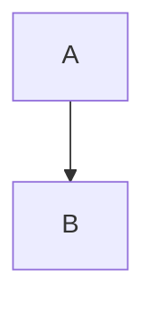

# HashMap #

HashMap 是通过hash的方式，来存储 k-v 对的一个对象。简单来说，就是在 k 上面添加索引，通过 k 上的索引能够快速的找到 v 。因为通常 k-v 是一个整体的数据结构。这样能将 list 遍历查找的时间复杂度从O(n) 降低到 O(1)。

## 基本数据结构 ##

在 Java 1.7 中，HashMap 是由数组和链表组装而成的。而在 Java 1.8 中，在原来的数据结构的基础上，添加了红黑树，结构更加复杂了，但是效率也变高了。

## 基本流程 ##



## 几个阈值 ##

```java
    /**
     * 默认的初始容量 - 必须是2的n次方
     */
    static final int DEFAULT_INITIAL_CAPACITY = 1 << 4; // aka 16

    /**
     * 最大容量，如果某个具有参数的构造函数隐式指定了更高的值，则使用该值。
     * 必须是2的n次方。
     */
    static final int MAXIMUM_CAPACITY = 1 << 30;

    /**
     * 构造函数中未指定时，使用的负载因子。
     * size / capacity > DEFAULT_LOAD_FACTOR 那么resize。
     */
    static final float DEFAULT_LOAD_FACTOR = 0.75f;

    /**
     * 存储的结构从list转化成tree的阈值。从list转化成tree的时候，应该大于8。
     */
    static final int TREEIFY_THRESHOLD = 8;

    /**
     * 存储的结构从tree转化成list的阈值。从tree转化成list的时候，应该小于等于8。
     */
    static final int UNTREEIFY_THRESHOLD = 6;

    /**
     * 可对存储的元素进行树型化的最小容量。
     * 没达到这个容量的话，会调整数组的大小。
     * 至少是4倍的树化阈值，才能避免调整数组的大小和树化阈值之间的冲突。
     */
    static final int MIN_TREEIFY_CAPACITY = 64;
```

## 几个字段 ##

```java

    /**
     * 数组。
     */
    transient Node<K,V>[] table;

    /**
     * 用来存储k-v对的set。
     */
    transient Set<Map.Entry<K,V>> entrySet;

    /**
     * 已经存储的k-v对的数量。
     */
    transient int size;

    /**
     * hashMap 发生结构性变化的次数。
     */
    transient int modCount;

    /**
     * 下一次的resize发生在这个值这里。
     * threshold = load factor * capacity
     * 
     * @serial
     */
    int threshold;

    /**
     * 负载因子，默认为0.75
     *
     * @serial
     */
    final float loadFactor;
```

## 构造方法 ##

### 默认的构造方法 ###

```java
    /**
     * 构造一个空的 HashMap，使用默认的容量16，和默认的负载因子0.75。
     */
    public HashMap() {
        this.loadFactor = DEFAULT_LOAD_FACTOR;
        // all other fields defaulted
    }
```

### 指定参数的构造方法 ###

```java
    /**
     * 构造一个空的 hashMap ，使用指定的初始容量和负载因子。
     *
     * @param  initialCapacity the initial capacity
     * @param  loadFactor      the load factor
     * @throws IllegalArgumentException 如果初始容量为负数或者负载因子非正数。
     */
    public HashMap(int initialCapacity, float loadFactor) {
        if (initialCapacity < 0)
            throw new IllegalArgumentException("Illegal initial capacity: " +
                                               initialCapacity);
        if (initialCapacity > MAXIMUM_CAPACITY)
            initialCapacity = MAXIMUM_CAPACITY;
        if (loadFactor <= 0 || Float.isNaN(loadFactor))
            throw new IllegalArgumentException("Illegal load factor: " +
                                               loadFactor);
        this.loadFactor = loadFactor;
        this.threshold = tableSizeFor(initialCapacity);
    }
```

```java
    /**
     * 返回大于等于cap的最小的2的n次方。
     */
    static final int tableSizeFor(int cap) {
        int n = cap - 1;
        n |= n >>> 1;
        n |= n >>> 2;
        n |= n >>> 4;
        n |= n >>> 8;
        n |= n >>> 16;
        return (n < 0) ? 1 : (n >= MAXIMUM_CAPACITY) ? MAXIMUM_CAPACITY : n + 1;
    }
```

##